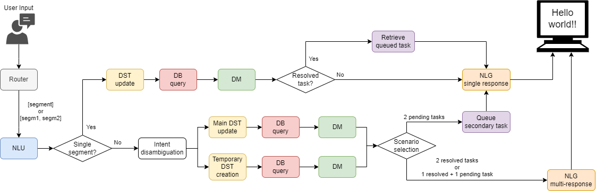

# Aquatic Center Chatbot

This repository contains the final project developed for the **Human-Machine Dialogue course**.

The project consists of a task-oriented chatbot designed for the customer service of an aquatic center. The chatbot supports common front-desk interactions such as asking for information, booking services, modifying or cancelling reservations, reporting lost items, and interacting with a simple shop.

## Pipeline Architecture

The following diagram shows the modular pipeline used by the chatbot, from user input processing to final response generation.



## Architecture

The chatbot follows a modular hybrid architecture that combines LLM-based components with deterministic logic.

The main components are:

* **Router**: splits the user message into segments and assigns an intent to each segment.
* **NLU**: extracts slot values from the selected user segment.
* **Dialogue State Tracker**: keeps track of the active intent and collected slots.
* **Database and Domain Validation**: validates values and decides whether the task can continue or be completed.
* **Dialogue Manager**: converts the database result into a structured next best action.
* **NLG**: generates the final natural language response for the user.

This hybrid approach allows the system to use LLMs for language flexibility while keeping task execution and validation under deterministic control.

## Models Evaluated

The intrinsic evaluation compared the following models:

| Component               |    Gemma3 | Mistral | Qwen2.5 |     Qwen3 |
| ----------------------- | --------: | ------: | ------: | --------: |
| Router segment accuracy | **0.955** |   0.940 |   0.905 |     0.940 |
| NLU slot micro F1       |     0.824 |   0.529 |   0.869 | **0.936** |
| DM exact-match accuracy |     0.996 |   0.996 |   0.940 | **1.000** |
| NLG acceptance rate     |     0.941 |   0.941 |   0.912 | **1.000** |
| **Final average score** |     0.929 |   0.851 |   0.906 | **0.969** |

The final average score is computed as the simple average of the four intrinsic component metrics.

Based on these results, **Qwen3-4B** was selected as the main model for the final chatbot evaluation.

## Running the Chatbot

The easiest way to test the chatbot is to open the UI notebook:

```text
UI_chatbot.ipynb
```

The notebook is designed to run the chatbot interactively and allows testers to try realistic conversations with the aquatic center assistant.

## Notes

This project was developed for academic purposes. The database is a mock database created to simulate the services, constraints and user bookings of an aquatic center.
